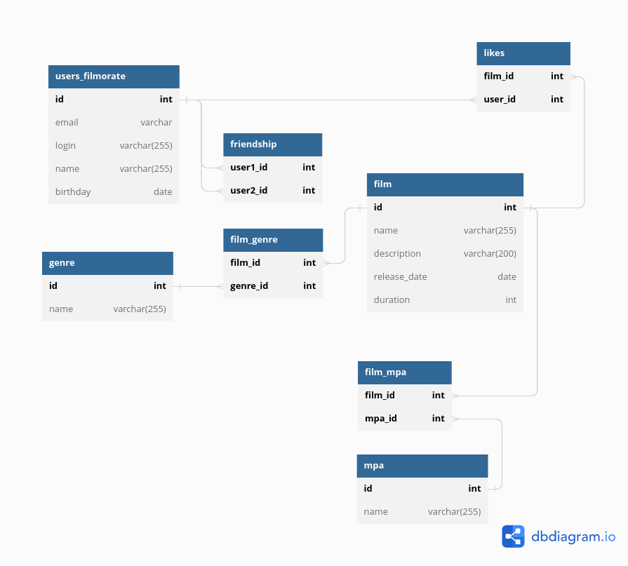

# java-filmorate

### ER-диаграмма


## Основные сущности:
### 1. users_filmorate - пользователи
| id | email | login | name | birthday |
| --- | --- | --- | --- | --- |
| 1 | email1@gmail.com | login1 | name1 | 1990-01-10 |
| 2 | email2@gmail.com | login2 | name2 | 1990-01-12 |
| 3 | email3@gmail.com | login3 | name3 | 1990-01-14 |
| 4 | email4@gmail.com | login4 | name4 | 1990-01-16 |
| 5 | email5@gmail.com | login5 | name5 | 1990-01-18 |

Для организации "дружбы" между пользователями создана таблица **friendship**:
 
| user1_id | user2_id |
| --- | --- |
| 1 | 2|
| 2 | 1 |
| 1 | 3 |
| 4 | 1 |

- Запись в таблице (1, 2) означает, что Пользователь с id=1 добавил в друзья Пользователя с id=2.
- Пользователь id=1 также добавил в друзья Пользователя id=1 - запись (2, 1). Теперь они взаимные друзья.
- Пользователь id=1 также хочет дружить с Пользователем id=3 - запись (1, 3). Но тот еще не увидел запрос на дружбу.
- Пользователь id=1 получил запрос от id=4, но делает вид, что не заметил. Дружба не подтверждена. 

Для пользователя можно получить список "друзей" (т.е. "подписок" - направленных запросов на дружбу).
Также можно получить список подтвержденных друзей и список запросов на дружбу, подтвердить запрос на дружбу.

Для получения списка подтвержденных друзей пользователя id=1 (результат - список id) выполняется запрос:
```sql
SELECT f1.user2_id FROM friendship AS f1
JOIN friendship AS f2 ON f1.user2_id = f2.user1_id AND f2.user2_id = f1.user1_id 
WHERE f1.user1_id = 1;
```
Пользователь также может ставить "лайки" фильмам. Для этого предусмотрена таблица **likes**.
Запись (1,2) означает, что Пользователю id=2 нравится Фильм id=1.

| film_id | user_id |
| --- | --- |
| 1 | 2|
| 1 | 3 |

### 2. film - фильмы

| id | name | description | release_date | duration |
| --- | --- | --- | --- | --- |
| 1 | title1 | some words about film | 2000-10-10 | 120 |

- У фильма также есть свойство "рейтинг MPA" и "жанр" (жанров может быть несколько).
- Рейтинг и жанры хранятся в отдельных таблицах. 
